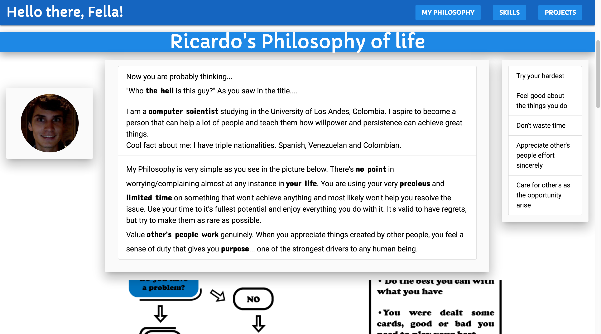

# rgonzalezp.github.io project
## Table of Contents
- [Objectives](#objectives)
- [Technologies](#technologies)
- [Author](#author)
- [Quickstart](#quickstart)
- [Documentation](#documentation)
- [Supported Browsers](#supported-browsers)
- [Preview](#preview)
- [Copyright and license](#copyright-and-license)

## Objectives
- Teach people what i believe in and motivate them to change for good.

- Make people know my core values and know me as a person.

- Let people know on what things i have worked on and the possible abilities i have.

- Have a portfolio which i can improve and update 

## Technologies
- HTML, CSS and Javascript
- Front-end frameworks materialize,bootstrap and W3C_school

## Author:
- Ricardo Enrique Gonzalez Penuela: https://rgonzalezp.github.io/

## Quickstart:

- Fork the repository or clone it
- Have npm or install npm (Or node.js)
- Install with [npm](https://www.npmjs.com) a quick server runner package called http-server: `npm install http-server`
- Go to project directory and use http-server command in the terminal to deploy it (Check the ip given in the terminal)

## Documentation
- All the personally developed JavaScript and Css used are located in js/useful.js and css/personal.css with their description

## Supported Browsers:
rgonzalezp.github.io runs with:

- Chrome 35+
- Firefox 31+
- Safari 9+
- Opera
- Edge
- IE 11+

## Preview

## Copyright and license
Code Copyright 2018 Ricardo Enrique Gonzalez Peñuela. Code released under the MIT license.
